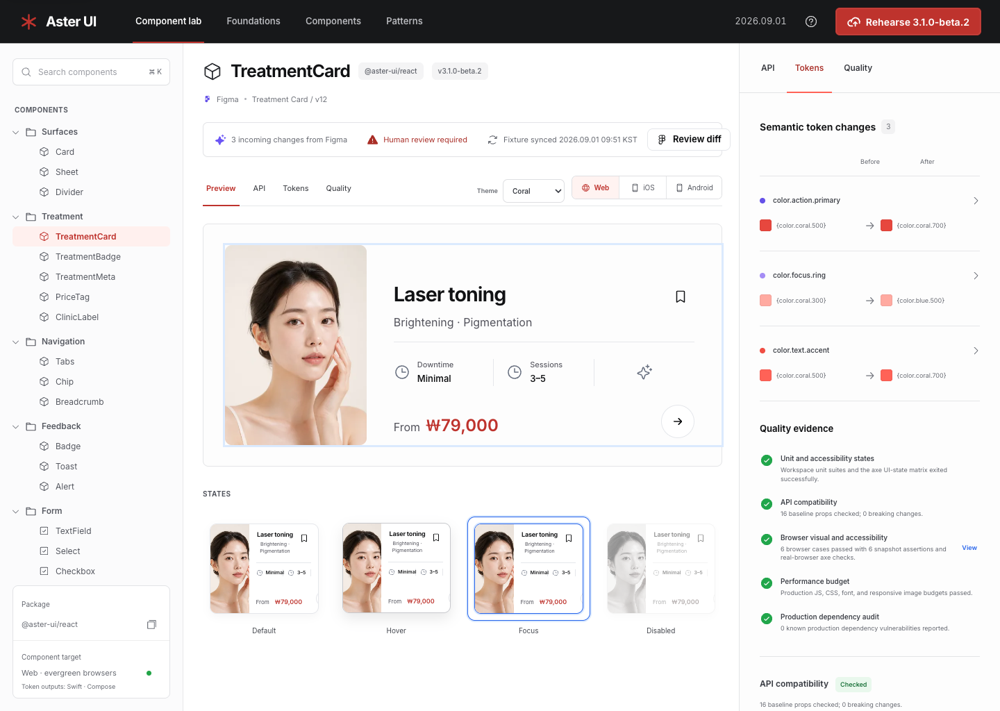

# Aster UI Platform

의료미용 제품군의 디자인 언어를 운영하는 디자인 시스템 제품 PoC입니다. 선택된 상용 시안을 유지하면서 Figma 변경 검토, 다중 테마 토큰 생성, React 공개 API, 품질 근거, 로컬 릴리스 리허설을 하나의 end-to-end 흐름으로 구현했습니다.



최종 시안과 구현 비교는 [Design QA](design-qa.md), 실행 근거는 [Production Verification](reports/verification.md)에서 확인할 수 있습니다.

## 구현 범위

- `apps/studio`: React, Vite, Tailwind CSS 기반의 반응형 운영 도구
- `packages/react`: 표준 article 속성과 ref를 전달하는 `Button`, `TreatmentCard` 웹 컴포넌트
- `packages/tokens`: W3C DTCG 소스에서 Coral, Ocean 테마를 생성하는 Style Dictionary 파이프라인
- `packages/figma-bridge`: Figma fixture의 alias와 변경 수를 검증하는 플랫폼 중립 리뷰 모델
- `scripts`: API 호환성, 문서, 도입률, 버전, 성능, 품질 근거 자동화
- `.github/workflows`: 단위 테스트, 실제 브라우저 검증, 의존성 감사, release-please 게이트
- `infra`: 비루트 Nginx 이미지와 읽기 전용 Kubernetes 런타임 기준

웹 컴포넌트는 Web 전용입니다. iOS와 Android에는 네이티브 컴포넌트를 가장하지 않고, 동일한 DTCG 소스에서 생성한 Swift 및 Compose 토큰 파일을 제공합니다.

## 핵심 흐름

1. Figma `Treatment Card / v12` fixture의 3개 변경을 읽고 before, after alias가 실제 DTCG 경로인지 검증합니다.
2. 사람이 CSS, Swift, Compose 토큰 영향을 확인하고 검토 완료로 표시합니다.
3. Coral 또는 Ocean 테마와 Web 참조 anatomy를 확인합니다.
4. 생성된 API manifest, 접근성, 시각 회귀, 성능, 보안 근거를 검토합니다.
5. 외부 레지스트리를 변경하지 않는 `3.1.0-beta.2` 로컬 릴리스 리허설을 실행합니다.

Figma 연결과 레지스트리 배포는 교체 가능한 경계로 남겨 두었습니다. 현재 UI는 fixture와 로컬 리허설임을 명시하며 실제 동기화나 배포 성공으로 표현하지 않습니다.

## 실행

```bash
pnpm install
pnpm dev
```

```bash
pnpm verify
```

`pnpm verify`는 보안 감사, 정적 검사, 단위 및 커버리지 테스트, Sites 런타임, 실제 Chrome 시각 및 접근성 테스트를 순서대로 수행합니다. 마지막에 workspace source revision, Git commit, 각 실행의 timestamp, run ID, artifact digest를 결합한 품질 근거를 생성하고 Studio를 다시 빌드합니다.

Playwright 테스트는 데스크톱 Coral과 Ocean, Figma drawer, 릴리스 dialog의 기준 이미지를 검증합니다. 같은 스위트에서 실제 Chrome axe, 키보드 탭, 1280px 데스크톱 경계, 200% 확대 상당 뷰포트, 모바일 탐색, forced-colors도 확인합니다.

## 검증 가능한 계약

- 모든 패키지, 토큰 상수, release-please manifest, changelog, Kubernetes version metadata의 일치
- TypeScript AST에서 `TreatmentCardProps` manifest와 문서 생성
- baseline prop 제거, 타입 변경, optional-to-required 변경, 기본값, ref, DOM 속성 전달, 플랫폼 계약 변경 차단
- 선언된 소비 앱과 eligible component를 분모로 계산한 도입률
- JavaScript와 CSS gzip 크기, 최대 이미지 크기, PNG 미출시 예산
- source version과 theme, reviewer, change fingerprint, 품질 digest를 포함한 versioned receipt
- 불변 Docker digest와 GitHub Action SHA, Kubernetes image digest renderer, 프로덕션 의존성 감사

Kubernetes 배포 파일은 mutable tag를 포함하지 않습니다. 실제 레지스트리 digest를 주입해 렌더링합니다.

```bash
pnpm k8s:render -- --image 'registry.example/aster-ui-studio@sha256:<64-hex>' --output /tmp/aster-ui.yaml
```

현재 저장소에는 Git commit 이력이 없어 Studio 품질 화면은 근거 출처를 `working-tree`로 표시합니다. CI 설정은 포함되어 있지만 실행 이력이 생기기 전에는 UI에서 CI 성공을 주장하지 않습니다.

상세 설계는 [아키텍처](docs/architecture.md), [접근성](docs/accessibility.md), [Figma 파이프라인](docs/figma-pipeline.md), [릴리스와 호환성](docs/release-and-compatibility.md), [AI 운영 원칙](docs/ai-governance.md)을 참고하세요.
