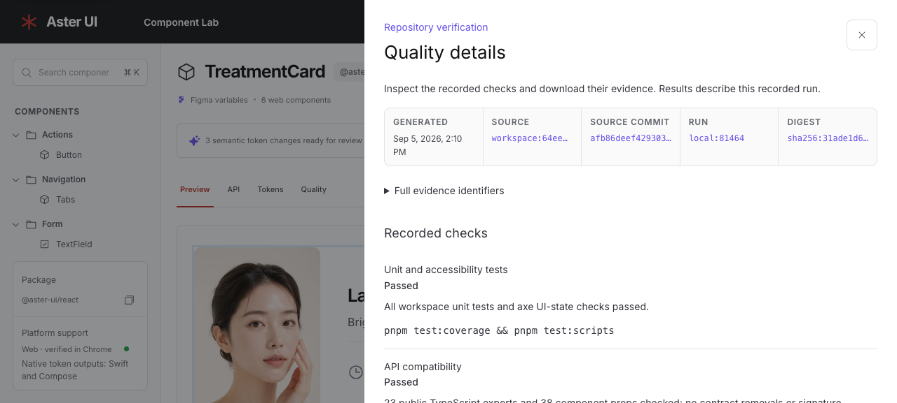

# 추가 개선 검증 결과

아래는 구현 직후의 검증 기록이다. 이후 제출본 정합성 문서를 추가하고 소스 커밋 기준으로 검증 근거를 다시 생성한다. 현재 출처와 수치는 [자동 생성 검증 보고서](../../reports/verification.md)를 기준으로 확인한다.

- 전체 `pnpm verify` 통과. 검증 보고서와 근거 일치 검사도 스크린샷 갱신 후 통과했다.
- 소스: `workspace:64ee6179b1850b914fcb`
- Studio: 42개 테스트, statements 94.15%, branches 87.67%.
- macOS Chrome: 28개 시나리오, 11개 시각 기준 이미지, axe 16회 통과.
- Linux Ubuntu 24.04 arm64: 공식 Playwright 1.62.1 이미지에서 UI 시나리오 27개 통과. Linux 기준 이미지 11개를 갱신한 뒤 읽기 전용 재실행에서도 27개가 통과했다. 브라우저 성능 측정은 macOS 전체 검증에 포함되며 Linux 반복 실행에서는 제외했다.
- 최종 번들: JS gzip 96,965 B, CSS gzip 11,308 B.
- Lab 중앙값: FCP 556 ms, LCP 556 ms. 실제 사용자 성능 수치가 아니다.
- 최종 production 화면에서도 시나리오 28개, 브라우저 보고서 다운로드 링크, 과거 근거 경고 없음 상태를 확인했다.
- 검증용 전용 Colima 환경은 검증 후 삭제했다. 기존 프로젝트 환경은 삭제하지 않았다.

