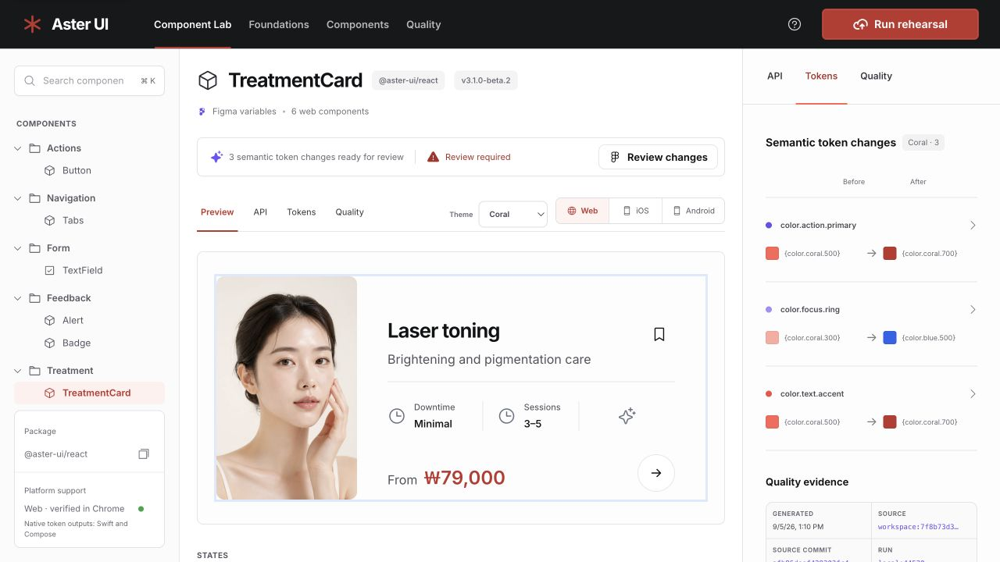
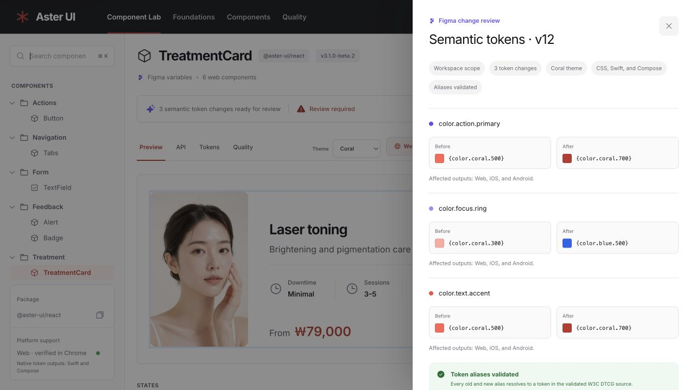
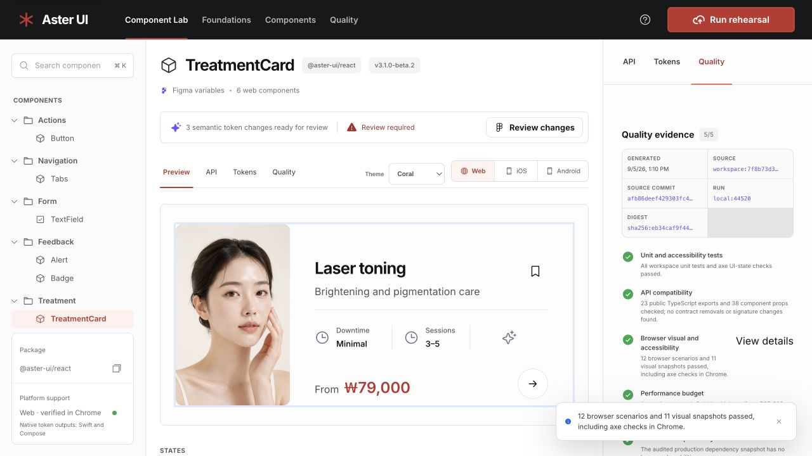

# Aster UI 추가 검토

검토일: 2026-09-05. 대상: 현재 작업 디렉터리의 소스와 로컬 production preview. 이번 검토에서는 제품 소스를 수정하지 않았다. 앞서 반영한 변경은 유지했다.

## 판단

추가 개선이 필요하다. 우선순위는 모달 포커스 오류, 문서 생성기의 기본값 추출 오류, 품질 근거를 확인하는 동선이다. 디자인은 기존 검은 상단 바, coral 강조색, 넓은 미리보기와 오른쪽 inspector를 유지하면서 탐색 구조와 글자 크기를 정리할 수 있다.

## 확인한 화면 흐름

1. **Component Lab 초기 화면 — 개선 권장.** 컴포넌트 선택, 미리보기, 변경 상태가 구분된다. 다만 상단 Foundations/Components/Quality와 중앙 Tokens/API/Quality가 같은 화면을 다른 이름으로 가리킨다. 오른쪽에도 API/Tokens/Quality가 있어 세 영역의 역할을 학습해야 한다. 1280 × 720 화면에서 토큰 별칭과 검증 메타데이터는 매우 작다.

   

2. **Review changes → ⌘K — 오류 재현.** 변경 검토 창은 유지되지만 접근성 트리의 focused UI element가 Close에서 배경의 Search components로 이동했다. 스크린샷만으로 포커스를 판정하지 않고 브라우저의 포커스 정보와 코드도 확인했다.

   

3. **Inspector Quality → View details — 개선 필요.** 버튼을 눌러도 상세 근거나 스냅샷은 열리지 않고 이미 표시된 성공 요약을 알림으로 반복한다. 사용자가 실제 검증 근거를 확인할 수 없다. 같은 버튼이 Tokens 요약과 Quality 화면에서 다른 글자 크기로 보인다.

   

## 발견 사항과 권장 조치

### 1. P2 / 접근성·코드 구조: 모달 밖으로 포커스 이동

- 근거: `apps/studio/src/components/Sidebar.tsx:38`, `apps/studio/src/hooks/useModalFocus.ts:39`, `apps/studio/src/App.tsx:73`.
- Sidebar의 전역 검색 단축키는 다른 모달 상태를 확인하지 않는다. 포커스 훅은 첫/마지막 요소에서 Tab을 누르는 경우만 처리한다. App의 sidebar/diff/release 상태도 별도의 boolean이다.
- 조치: 활성 overlay를 한곳에서 관리하고, 검토·리허설 창이 열리면 배경 검색 단축키를 제한한다. 배경의 inert 처리와 모달 외부 포커스 복구를 함께 적용한다.
- 완료 기준: 각 모달에서 ⌘K/Ctrl+K, Tab, Shift+Tab을 사용해도 배경으로 포커스가 이동하지 않는다. Escape와 닫기 후에는 원래 실행 버튼으로 돌아온다. 모바일의 중복 모달 여부는 별도 검증한다.

### 2. P2 / 코드 구조: API 문서 기본값을 잘못 추출할 수 있음

- 근거: `scripts/generate-component-manifest.mjs:31`.
- 현재 수집기는 파일 전체의 모든 BindingElement를 순회해 변수 이름을 키로 사용한다. 컴포넌트 뒤에 있는 무관한 함수의 `variant = 'ghost'`가 실제 컴포넌트의 `variant = 'primary'`를 덮어쓰는 것을 현재 수집기 코드와 격리된 TypeScript AST 예제로 재현했다.
- 이는 현재 모든 manifest 값이 잘못되었다는 의미는 아니다. 보조 함수가 추가될 때 문서와 실제 동작이 달라질 수 있는 생성기 결함이다.
- 조치: registry의 컴포넌트 선언과 props 매개변수에 한정해서 추출한다. 구조 분해 별칭도 원래 prop 이름으로 기록한다.
- 완료 기준: 무관한 함수, 지역 변수, 별칭 구조 분해가 공개 prop의 기본값을 오염시키지 않는 회귀 테스트가 통과한다.

### 3. P2 / 제품 동선: View details가 상세 정보를 제공하지 않음

- 근거: 화면 3, `apps/studio/src/App.tsx:249`.
- 조치: 시나리오 이름, 검증 시간, 스냅샷 또는 실제 보고서 등 확인 가능한 근거를 여는 동작으로 바꾼다. 제공할 수 있는 내용이 요약뿐이면 버튼 이름도 그 범위를 정확히 표현한다.
- 완료 기준: 사용자가 성공 문구에서 실제 검증 근거까지 이동할 수 있고 키보드로 상세 화면을 열고 닫을 수 있다.

### 4. P3 / 디자인: 탐색 역할과 보조 텍스트 계층 정리

- 근거: 화면 1·3, `apps/studio/src/components/TopBar.tsx:23`, `apps/studio/src/styles.css:493`, `apps/studio/src/styles.css:550`.
- 상단과 중앙은 같은 workspaceTab을 제어하고, 오른쪽은 독립적인 inspectorTab을 제어한다. 같은 API/Tokens/Quality 이름이 다른 범위를 뜻한다.
- 조치: 중앙을 컴포넌트 탐색, 오른쪽을 변경 검토 요약으로 명확히 구분한다. 상단은 실제 별도 영역이 있을 때만 내비게이션으로 유지하는 방향을 검토한다. 검증 설명·토큰 별칭은 읽기 쉬운 크기로 조정하고 긴 식별자는 펼치기나 복사로 제공한다.
- 8~10px 메타데이터, 9px 설명 텍스트, 패널별로 달라지는 View details 스타일을 공통 typography/action 스타일로 정리한다. CSS 파일을 단순히 나누는 것보다 동일한 UI의 스타일을 한곳에서 정의하는 것이 먼저다.
- 완료 기준: 화면별 역할이 명확하고, 1280px 및 1440px 화면과 200% 확대에서 중요 정보와 조작부가 읽히고 겹치지 않는다. 작은 글자 자체를 WCAG 위반으로 단정하지 않는다.

### 5. P3 / 탐색 상태: 컴포넌트 화면을 직접 공유할 수 없음

- 근거: `apps/studio/src/App.tsx:62`. 컴포넌트, 탭, 테마, 플랫폼이 React state의 고정 초기값으로 시작하며 URL과 연결되지 않는다.
- 조치: `component`, `tab`, `theme`, `platform`을 검증된 URL 상태로 관리한다. 검색어와 임시 모달까지 URL에 넣을 필요는 없다.
- 완료 기준: 특정 컴포넌트의 Ocean/Tokens 화면을 URL로 열 수 있고 새로고침과 뒤로가기가 예상대로 동작한다. 이번 항목은 소스 검토에 근거하며 별도 새로고침 시나리오는 실행하지 않았다.

### 6. P3 / 최적화: 검증 파이프라인의 중복 비용

- 근거: `turbo.json:14`, `package.json:26`, `apps/studio/package.json:10`.
- 모든 test/test:coverage가 자기 패키지 build까지 요구한다. Studio의 소스 단위 테스트에도 production 번들이 선행된다. 전체 verify는 일반 단위 테스트와 coverage 단위 테스트를 각각 실행한다.
- 조치: 빠른 로컬 검증과 전체 검증의 목적을 구분하고, coverage 실행에서 단위 테스트 근거를 함께 생성하는 방식과 Studio의 불필요한 자기 build 의존성 제거를 검토한다. 실제 절약 시간은 변경 전후 측정한다.
- tokens 테스트는 dist 출력물을 읽으므로 해당 build 의존성은 유지해야 한다. 시각 테스트의 고정 fixture 빌드와 최종 검증 근거를 담는 빌드도 목적이 다르므로 일괄 제거하면 안 된다.
- 런타임 성능은 현재 저장된 보고서상 gzip JS 94,358B, CSS 10,884B로 예산 안이다. 화면의 저장된 lab 결과는 FCP/LCP 중앙값 608ms, CLS 최대 약 0.00033이다. 이번 검토에서 다시 측정한 수치나 실제 사용자 지표는 아니다. 현 단계에서 무조건적인 memoization이나 코드 분할보다 검증 중복을 먼저 측정할 근거가 있다.

## 검토 범위와 한계

- 이번 실행에서 1280 × 720 데스크톱 화면 3개를 캡처하고 저장된 파일을 열어 확인했다.
- 모달 단축키, 품질 상세 버튼은 실제 브라우저에서 실행했다. 생성기의 기본값 충돌은 현재 수집기 코드를 사용한 격리 예제로 재현했다.
- 모바일 실기기, 스크린리더, 200% 확대, 실제 사용자 성능은 이번에 확인하지 않았다. 전체 접근성 준수를 보장하는 검토는 아니다.
- 전체 verify를 다시 실행하지 않았다. 이전 변경의 검증 결과와 이번 수동 검토를 구분해야 한다.
- 구현 권장 순서: 포커스 오류와 생성기 결함 → 품질 상세 동선 → 탐색·타이포그래피 → URL 상태 → 검증 시간 최적화.
